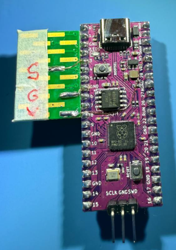
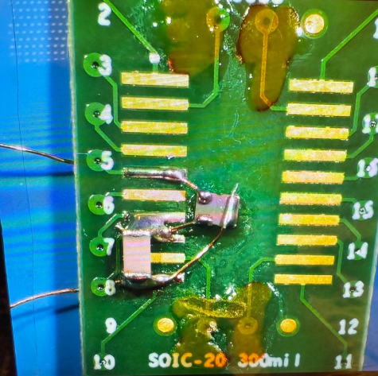
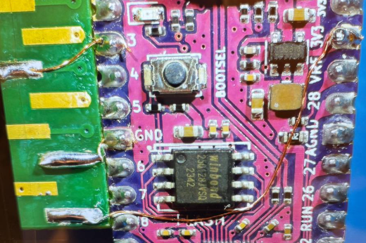
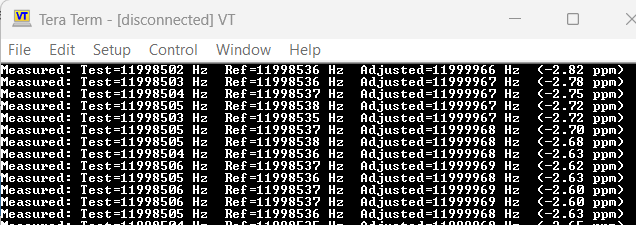

# Pico Frequency Meter with 12MHz TCXO Reference



This project is a **frequency measurement tool** based on the Raspberry Pi Pico and the RP2040 microcontroller. It uses the PWM hardware to count edges on two input signals—one is the test signal, and the other is a **12 MHz TCXO (Temperature Compensated Crystal Oscillator)** as a stable reference for accurate calibration. This setup allows you to compare an unknown oscillator’s frequency against a known precision source, which is useful for fine-tuning 12MHz crystals and capacitors in precision circuits, such as my keylogger implant OKHI or other low-level hardware projects.

https://github.com/therealdreg/okhi

---

## Story Behind the Project

This idea emerged after a valuable discussion with **Carlos (@EB4FBZ)**, an expert in electronics, who questioned my crap-functional testing approach for the QA (Quality Assurance) **OKHI** project. Thanks to this debate of ideas, I realized that I could build a **low-cost, high-precision frequency counter** using the hardware I already had—without needing to buy an expensive GPSDO (GPS Disciplined Oscillator). Much appreciation for the constructive feedback and technical inspiration!

---

## Hardware Setup

- **Test Signal (Device Under Test)** → Connect to **GPIO 1**
- **12 MHz TCXO Reference Signal** → Connect to **GPIO 3**

Both pins are configured as **PWM inputs** to count rising edges. Ensure signals are conditioned (square wave, CMOS levels) and within the Pico’s voltage limits.

---

## TCXO Reference Details

The oscillator used as a reference is the **ATXAIG-H12-F-12.000MHz-F25** by **ABRACON**:

| Attribute                       | Value                          |
| ------------------------------- | ------------------------------ |
| Manufacturer                    | ABRACON                        |
| Product Category                | TCXO Oscillators               |
| RoHS                            | Yes                            |
| Package/Case                    | SMD-4                          |
| Frequency                       | 12 MHz                         |
| Frequency Stability             | ±2.5 PPM                       |
| Load Capacitance                | 15 pF                          |
| Supply Voltage Range            | 1.68 V to 3.63 V               |
| Output Format                   | CMOS                           |
| Termination Style               | SMD/SMT                        |
| Operating Temperature           | -40 °C to +85 °C               |
| Dimensions                      | 2.5 mm × 2.0 mm × 1.0 mm       |
| Series                          | ATXAIG-H12                     |
| Packaging                       | Bulk                           |
| Current Consumption (Max)       | 10 mA                          |
| Max Duty Cycle                  | 55 %                           |

---

## DIY PICO Frequency Meter

Deadbug ATXAIG-H12-F-12.000MHz-F25



Follow the datasheet for the ATXAIG-H12-F-12.000MHz-F25 to wire it up correctly.


Use super glue to attach one PCB to another, then solder GND, VCC, AND REF PADS to PICO. REF is the TCXO reference signal (goes to GPIO3), and GND and VCC are the power supply pins. The ATXAIG-H12-F-12.000MHz-F25 is a 12 MHz TCXO with a frequency stability of ±2.5 PPM, which is suitable for this application.



Connect the test signal to GPIO 1 The Pico will count the edges of both signals and display the frequency of the test signal relative to the TCXO reference.

# Download last firmware

Download the latest firmware from the releases section:

https://github.com/therealdreg/pico-freq-meter-tcxo-ref/releases/latest

# Flashing the firmware

To flash the firmware, you need to put the Raspberry Pi Pico in bootloader mode. To do this, press and hold the button while connecting the USB cable to the PC. The Pico will appear as a USB mass storage device. Drag and drop the "pico_freq_meter_tcxo_ref.uf2" firmware file to the Pico.

# Usage

Once the firmware is flashed, you can connect the Pico to your computer via USB. The firmware will start counting the edges of the test signal and the TCXO reference signal. The output will be displayed in the terminal.

Connect using tera term or any serial terminal to see the output



# How it works

The firmware leverages the RP2040’s PWM hardware to accurately count rising edges on both the test signal (GPIO 1) and the 12 MHz TCXO reference signal (GPIO 3). Each signal is assigned to a separate PWM slice, allowing the microcontroller to independently and simultaneously count the number of rising edges for both inputs (PWM_DIV_B_RISING).

To determine the frequency of the test signal, the firmware uses a measurement window called the **gate time**, which is set to 5000 milliseconds (5 seconds) by default. During this period, the firmware counts how many rising edges occur on each input. The use of a relatively long gate time (5 seconds) significantly improves measurement accuracy by reducing the impact of  errors.

At the end of each gate interval, the firmware calculates the frequency of the test signal by comparing the counted edges to the known, highly stable TCXO reference. 

How is the frequency calculated? 

The frequency of the test signal is calculated using the following formula:

```
Frequency (Hz) = (Count of Test Signal Edges / Count of TCXO Edges) * 12,000,000
```

This formula is derived from the relationship between the test signal and the reference signal. The firmware counts the rising edges of both signals during a fixed measurement window (gate time). The **Count of Test Signal Edges** represents the number of rising edges detected on the test signal, while the **Count of TCXO Edges** represents the number of rising edges detected on the 12 MHz TCXO reference signal.

### Detailed Explanation

1. **Reference Frequency**: The TCXO provides a highly stable reference frequency of 12 MHz (12,000,000 Hz). This value is used as the baseline for all calculations.

2. **Edge counting**: During the gate interval, the firmware leverages the RP2040’s PWM hardware to tally rising edges on both the test signal and the TCXO reference. The raw counts are converted into frequencies—stored in the variables `f_test` and `f_ref` (in Hz), not as simple pulse counts.

3. **Frequency adjustment**: To compensate for any deviation in the TCXO’s actual output, the measured test frequency (`f_test`) is scaled by the ratio of the nominal reference frequency (`TCXO_FREQ`) to the measured reference frequency (`f_ref`). This yields the corrected test frequency:

    ```c
    // f_test and f_ref are in Hz
    const double TCXO_FREQ = 12e6;
    double adjusted_freq = f_test * (TCXO_FREQ / f_ref);
    ```

4. **PPM Deviation**: The firmware also calculates the deviation of the adjusted frequency from the reference frequency in parts per million (PPM). This is useful for evaluating the precision of the test signal. The PPM deviation is calculated as:

    ```
    PPM = (Adjusted Frequency - TCXO_FREQ) / TCXO_FREQ * 1,000,000
    ```

5. **Output**: The firmware outputs the measured test signal frequency, the reference signal frequency, the adjusted frequency, and the PPM deviation to the serial terminal. For example:

    ```
    Measured: Test=12,003,456 Hz  Ref=12,000,123 Hz  
    Adjusted=12,003,333 Hz  (27.78 ppm)
    ```

This approach ensures high precision by leveraging the TCXO's stability and compensating for any discrepancies in the measurement process.

Where:

- **Count of Test Signal Edges**: The number of rising edges counted on the test signal during the gate time.
- **Count of TCXO Edges**: The number of rising edges counted on the 12 MHz TCXO reference during the same gate time.
- **12,000,000**: The frequency of the TCXO reference in Hz (12 MHz).
This formula allows the firmware to accurately determine the frequency of the test signal relative to the stable 12 MHz reference, providing a reliable measurement even for signals that may not be perfectly square or have varying duty cycles.
# Features
- **Dual Input Measurement**: Simultaneously measures the frequency of a test signal against a stable 12 MHz TCXO reference.
- **High Precision**: Utilizes a 12 MHz TCXO with ±2.5 PPM stability for accurate frequency measurements.
- **Adjustable Gate Time**: Configurable measurement window (default 5 seconds) for improved accuracy.
- **PPM Calculation**: Displays the frequency deviation in parts per million (PPM) for precision evaluation.
- **Easy to Use**: Simple serial output for frequency readings, making it accessible for various applications.

# Measuring the Frequency of a 12MHz Crystal on an External RP2040 Board

To generate a clock signal on a specific GPIO pin, you can use the `clock_gpio_init` function. This function configures the pin to output a clock signal derived from a selected source, such as the XOSC, and allows you to set a divisor to adjust the output frequency.

```c
clock_gpio_init(GPIO, CLOCKS_CLK_GPOUT0_CTRL_AUXSRC_VALUE_XOSC_CLKSRC, divisor);
```

This setup enables you to output a clock signal directly from the RP2040, which can then be connected to the test signal input of the frequency meter. By setting the divisor to 1, the full 12 MHz frequency of the XOSC can be output. Alternatively, you can adjust the divisor to generate other frequencies as needed.

This method is particularly useful for measuring the frequency of a crystal oscillator without modifying its original circuit. It provides a non-intrusive way to evaluate the oscillator's performance while maintaining the integrity of the existing design. 

# Related 

- okhi: https://github.com/therealdreg/okhi
