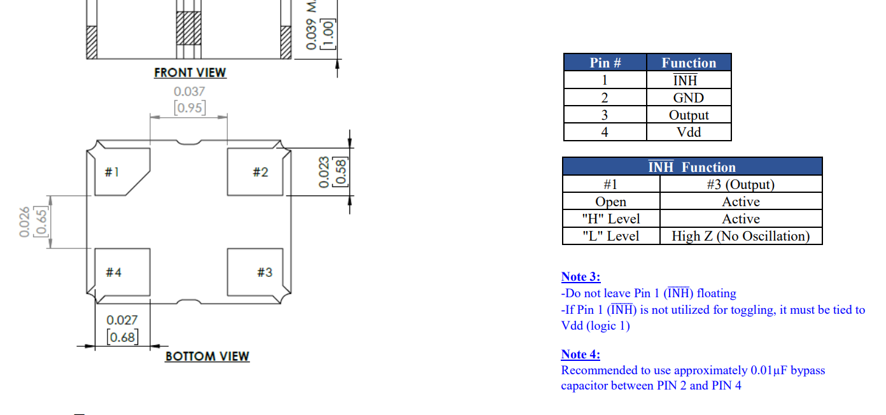

# Pico Frequency Meter with 12MHz TCXO Reference

This project is a **frequency measurement tool** based on the Raspberry Pi Pico and the RP2040 microcontroller. It uses the PWM hardware to count edges on two input signals—one is the test signal, and the other is a **12 MHz TCXO (Temperature Compensated Crystal Oscillator)** as a stable reference for accurate calibration. This setup allows you to compare an unknown oscillator’s frequency against a known precision source, which is useful for fine-tuning 12MHz crystals and capacitors in precision circuits, such as my keylogger implant OKHI or other low-level hardware projects.

https://github.com/therealdreg/okhi

---

## Story Behind the Project

This idea emerged after a valuable discussion with **Carlos (@EB4FBZ)**, an expert in electronics, who questioned my crap-functional testing approach for the QA (Quality Assurance) **OKHI** project. Thanks to this debate of ideas, I realized that I could build a **low-cost, high-precision frequency counter** using the hardware I already had—without needing to buy an expensive GPSDO (GPS Disciplined Oscillator). Much appreciation for the constructive feedback and technical inspiration!

---

## Hardware Setup

- **Test Signal (Device Under Test)** → Connect to **GPIO 1**
- **12 MHz TCXO Reference Signal** → Connect to **GPIO 3**

Both pins are configured as **PWM inputs** to count rising edges. Ensure signals are conditioned (square wave, CMOS levels) and within the Pico’s voltage limits.

---

## TCXO Reference Details

The oscillator used as a reference is the **ATXAIG-H12-F-12.000MHz-F25** by **ABRACON**:

| Attribute                       | Value                          |
| ------------------------------- | ------------------------------ |
| Manufacturer                    | ABRACON                        |
| Product Category                | TCXO Oscillators               |
| RoHS                            | Yes                            |
| Package/Case                    | SMD-4                          |
| Frequency                       | 12 MHz                         |
| Frequency Stability             | ±2.5 PPM                       |
| Load Capacitance                | 15 pF                          |
| Supply Voltage Range            | 1.68 V to 3.63 V               |
| Output Format                   | CMOS                           |
| Termination Style               | SMD/SMT                        |
| Operating Temperature           | -40 °C to +85 °C               |
| Dimensions                      | 2.5 mm × 2.0 mm × 1.0 mm       |
| Series                          | ATXAIG-H12                     |
| Packaging                       | Bulk                           |
| Current Consumption (Max)       | 10 mA                          |
| Max Duty Cycle                  | 55 %                           |

---

## DIY PICO Frequency Meter

Deadbug ATXAIG-H12-F-12.000MHz-F25

Follow the datsaheet for the ATXAIG-H12-F-12.000MHz-F25 to wire it up correctly.

Use super glue to attach one PCB to another, then solder GND, VCC, AND REF PADS to PICO. REF is the TCXO reference signal (goes to GPIO3), and GND and VCC are the power supply pins. The ATXAIG-H12-F-12.000MHz-F25 is a 12 MHz TCXO with a frequency stability of ±2.5 PPM, which is suitable for this application.

Connect the test signal to GPIO 1 The Pico will count the edges of both signals and display the frequency of the test signal relative to the TCXO reference.

Connect using tera term or any serial terminal to see the output:

